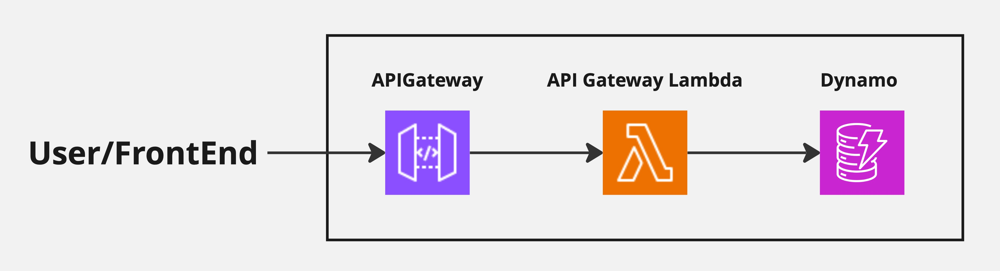

# Single Page Application Skeleton

#### An SPA Skeleton for easy customization and reuse.

## Overview
### BackEnd
API Gateway + Lambda + Dynamo


Pre-built API endpoints:
- Get all entries: `GET /entries`
- Get single entry: `GET /entries/:id`
- Register new entry: `POST /entries/:id`
- Update single entry: `PUT /entries/:id`
- Delete single entry: `DELETE /entries/:id`

For more details on the parameters required for each endpoint, refer to [handlers.rs](./lambda/src/handler/handlers.rs)


### FrontEnd
Built in Next.js.


## Set Up
1. Download the repository
2. Set Up AWS CDK as described [here](https://docs.aws.amazon.com/cdk/v2/guide/prerequisites.html)
3. Start Docker daemon
4. Run the following command
```
cd cdk
cdk deploy --all
```
This will create the following resources.
- Dynamo Table
    - primary key: `id`
    - GSI: `user_id`
- API Gateway acting as Lambda proxy
- Lambda for handling requests
- App Runner for running Next.js Demo app


### Backend only
If you want to deploy the FrontEnd somewhere else, you could deploy the backend only with the following command.
```
cd cdk
cdk deploy SPADatabaseStack
cdk deploy SPAHandlerStack
```
Note that in this case, you will need to manually set up the environment variable `API_ENDPOINT` for your Next.js App.
```
API_ENDPOINT="https://api_gateway_endpont_url/stage_name/"
```